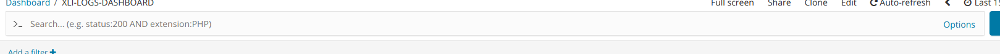
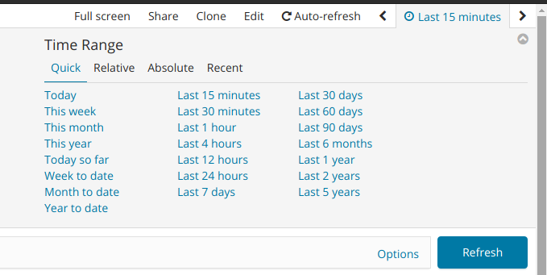
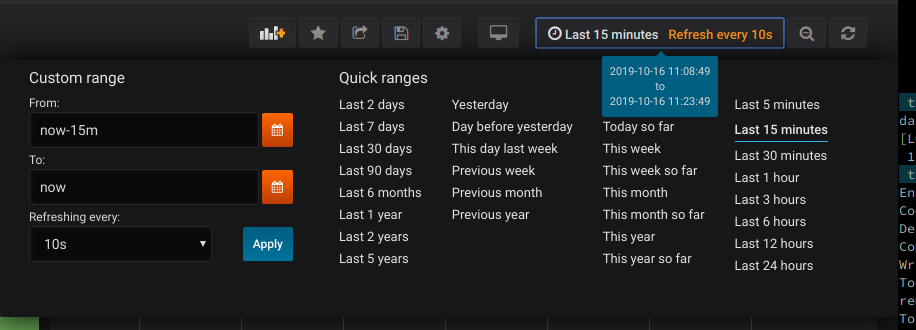

# xl-up-blueprint
This blueprint is usable only on `xl up` command . Cannot be used separately with `xl blueprint` command.

If you run `xl up` command on a machine where access to internet is not available. Copy this repository to your machine and run `xl up -lb /path/to/downloaded/git-repo/xl-up`

## Monitoring

### Introduction

By default, `xl up` will install the following components

- Elasticsearch 
- Kibana
- FluentD
- Prometheus
- Grafana

By using these components, issues in the XL DevOps platform can quickly be identified and remedied. The dashboards and visualizations provided should be enough to get you started, but feel free to modify them according to your needs. 

### Querying from Kibana

The simplest form of queries in Kibana is called a [Lucene Query](https://www.elastic.co/guide/en/kibana/current/lucene-query.html). For example, to find XL Deploy logs for a failed deployment, you can execute the following query directly in Kibana:

```
log:"com.xebialabs.platform.script.jython.JythonException: Error while executing script" AND kubernetes.namespace_name.keyword:"xebialabs"
```

This can be added to the `Search` bar at the top of the default dashboard, or on the "Discover" tab, as pictured below. You can open one of the results, and then optionally click on "View surrounding documents" to get more context about a specific log entry.



To find logs for a specific time, for example the last hour, click on the link in the top right corner of the dashboard (see image below), and select "Last 1 Hour".



Of course, Elasticsearch is much more powerful and you can tailor dashboards and searches by using the more advanced query/filter options available in the [Elasticsearch Query DSL](elastic.co/guide/en/elasticsearch/reference/current/query-dsl.html)

### Querying from Grafana

The Grafana implementation provided by the `xl up` command hooks into the deployed [Prometheus](https://prometheus.io) instance to aggregate and visualize metric data coming from the XL DevOps Platform. 

The default `XebiaLabs Monitoring` dashboard gives insights on the JVM and OS level metrics coming from XL Deploy and XL Release, as well as additional metrics on the provisioned resources. Feel free to customize this dashboard according to your needs. 

As with Kibana, Grafana can also show statistics for a certain time period, as pictured below.



